# post!t.

**post!t.** is a Twitter/X-inspired mini social media application built as a full-stack project.  
It includes authentication, timeline feeds, post interactions, profile pages, search, notifications, media support, and a messaging system.

This project was developed to practice both **backend architecture** and **frontend product behavior** in a real-world social media flow.

---

## Features

### Authentication
- User registration
- User login
- JWT-based authentication
- Protected routes for authenticated users

### Feed & Posting
- Home timeline
- **For You** feed
- **Following** feed
- Create posts
- Create comments
- Repost entries
- Quote entries
- Like / unlike entries
- Repost / undo repost
- Update entry
- Delete entry
- Media attachment support

### Entry Detail
- Dedicated post detail page
- Comment thread display
- Parent-child conversation structure
- Embedded original entry support for quote entries

### Profile
- User profile page
- Profile update
- Follow / unfollow users
- Profile tabs:
  - Posts
  - Replies
  - Likes
  - Media

### Search
- User search
- Entry search
- Search tabs
- Recent search UI

### Notifications
- Like notifications
- Comment notifications
- Repost notifications
- Quote notifications
- Read / unread notification logic

### Messaging
- Conversation list
- Full-page messaging screen
- Docked messages panel
- Docked quick chat window
- New message modal
- Unread message count
- Mark conversation messages as read

### Media
- Entry media table support
- Multiple media items per entry
- Media viewer modal
- Upload endpoint for media files

---

## Screenshots

## Authentication

### Login

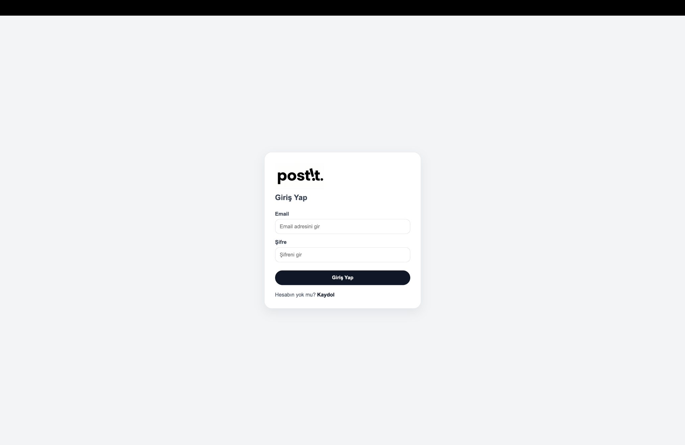

### Register

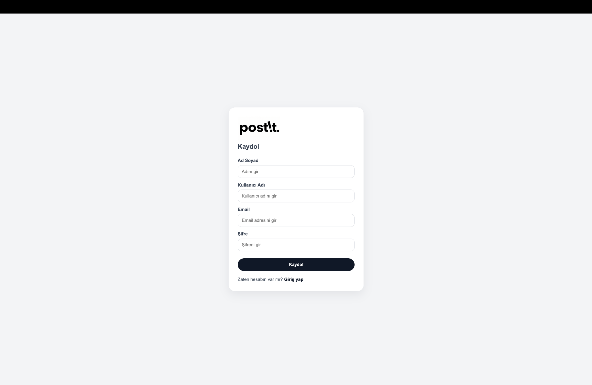

---

## Feed & Entry Flow

### Home

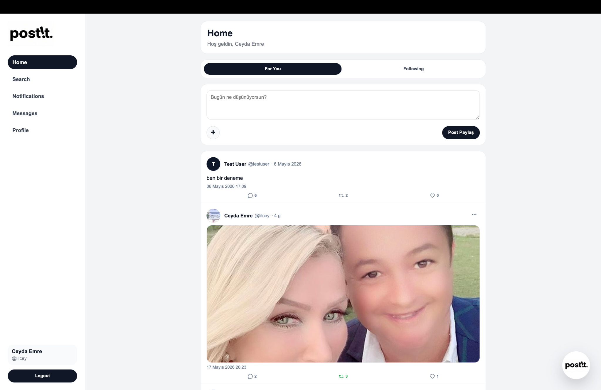

### Entry Detail

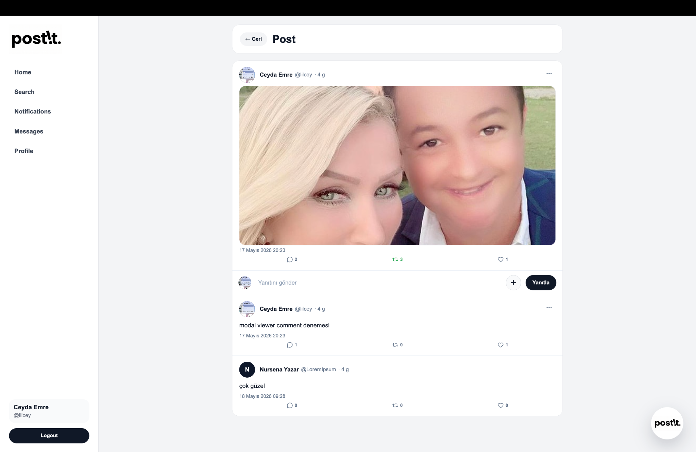

### Media Viewer

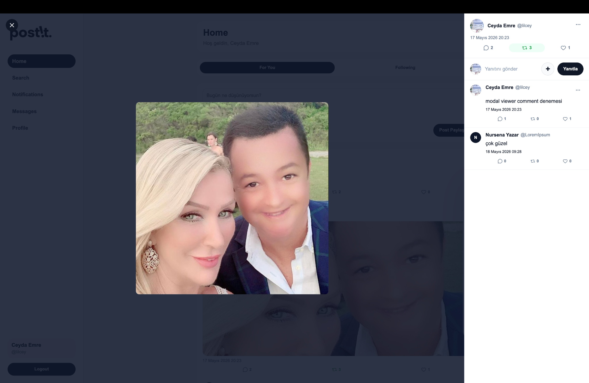

---

## Profile

### Profile Page

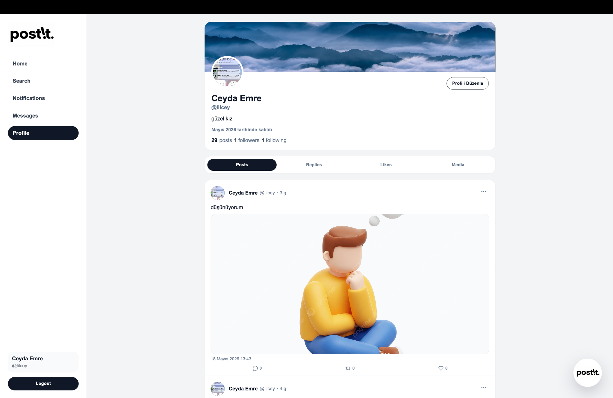

---

## Search

### Search - Blank State

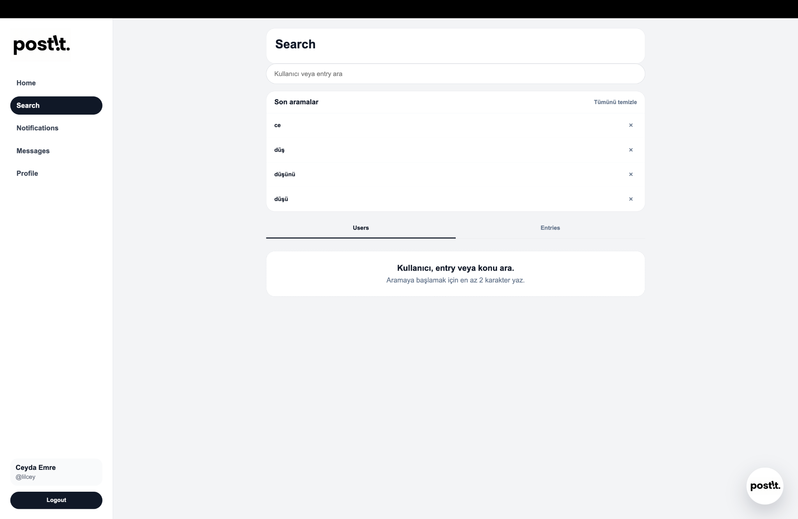

### Search - Users

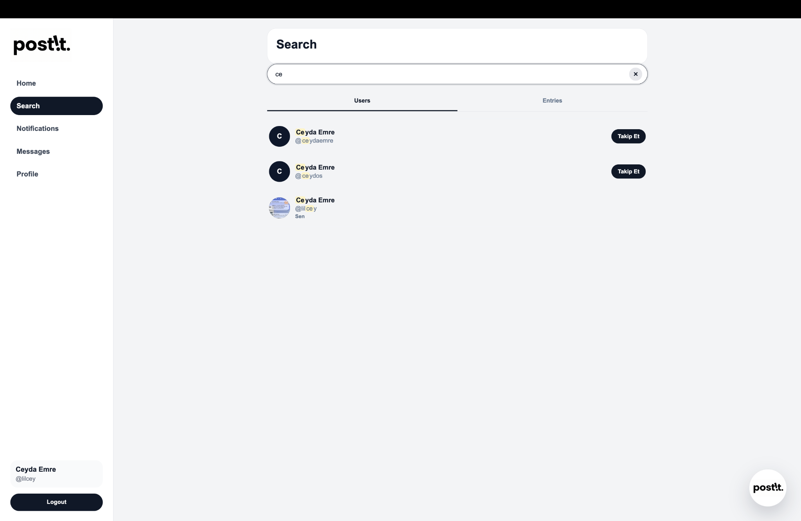

### Search - Entries

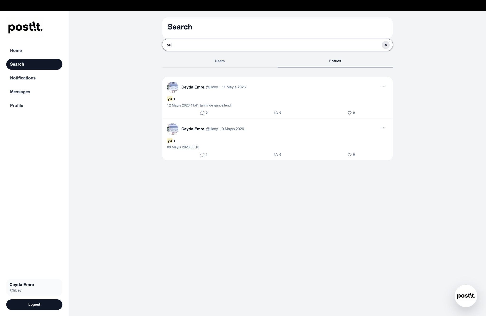

---

## Notifications

### Notifications Page

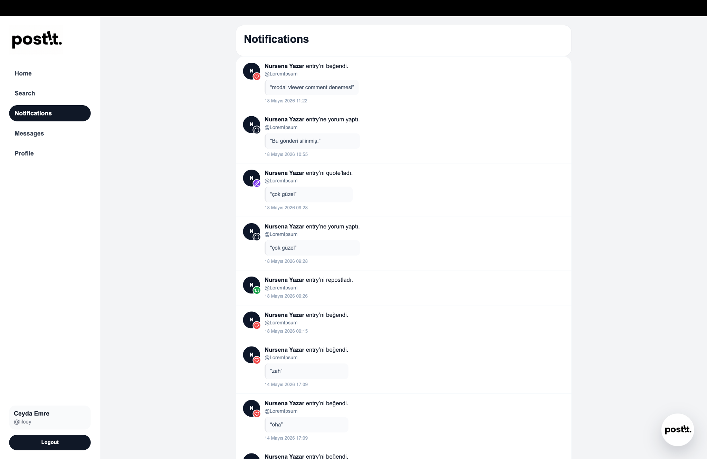

---

## Messages

### Messages Page

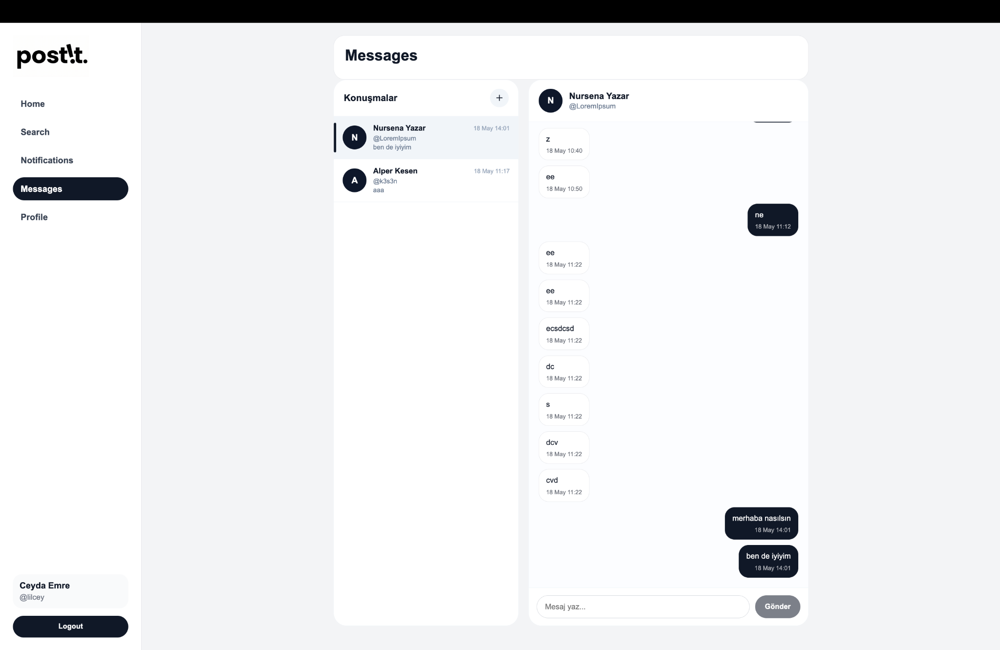

### Messages Dock

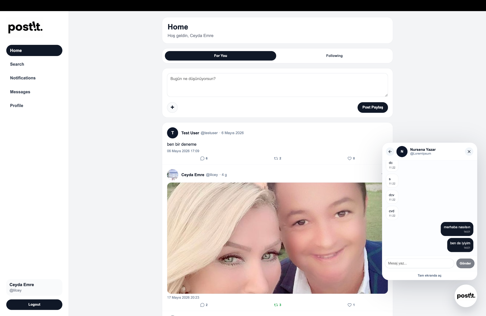

### Messages Dock Chat

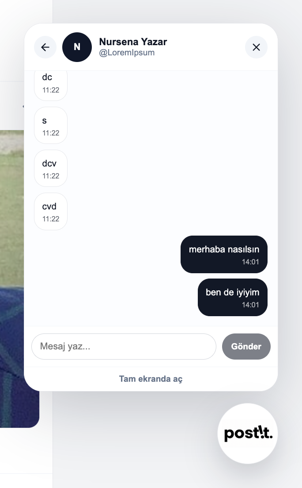

### New Message

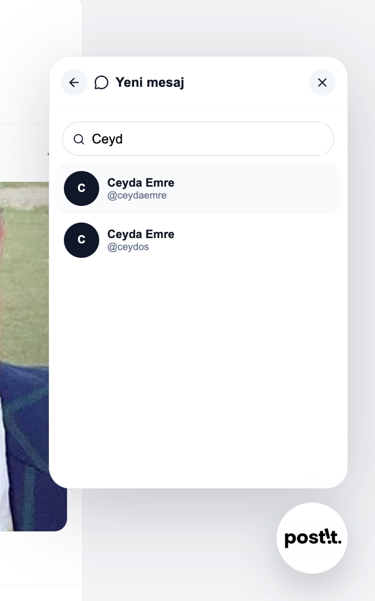

---

## Tech Stack

### Backend
- Node.js
- Express.js
- PostgreSQL
- JWT
- bcrypt
- multer
- cors
- dotenv

### Frontend
- React
- Vite
- React Router
- CSS

---

## Architecture

The backend follows a layered structure:

```text
Route -> Controller -> Service -> Database
```

This structure helps keep responsibilities separated:

- **Routes** define endpoints
- **Controllers** receive requests and return responses
- **Services** contain business logic
- **Database layer** handles SQL queries with PostgreSQL

---

## Project Structure

```text
mini-post-app-with-db/
│
├── client/
│   ├── public/
│   │   └── readme-screenshots/
│   └── src/
│       ├── api/
│       ├── components/
│       ├── layouts/
│       ├── pages/
│       └── ...
│
├── server/
│   ├── config/
│   ├── controllers/
│   ├── middlewares/
│   ├── routes/
│   ├── services/
│   └── ...
│
└── README.md
```

---

## Backend Highlights

### Unified Entry Model

Instead of handling post, comment, repost, and quote as completely separate content models, the project uses a **single `entries` table** with a `type` field.

Supported types:

- `POST`
- `COMMENT`
- `REPOST`
- `QUOTE`

This makes the system more consistent and reduces repeated response structures.

### Timeline Logic

The project supports:

- **For You** feed
- **Following** feed

The **For You** feed is built using a simple ranking logic based on:

- likes
- comments
- reposts / quotes
- recency

### Hydration Logic

Raw database rows are transformed into richer response objects that include:

- author
- media
- stats
- viewer state
- repost info
- embedded original entry

This allows the frontend to consume a more usable response structure.

### Cursor Pagination

Timeline pagination uses cursor-based logic for more stable scrolling behavior compared to classic offset-only pagination.

---

## Database Design

Main tables:

### `users`

Stores user account information.

- full_name
- username
- email
- password_hash
- bio
- profile_image_url
- banner_image_url

### `entries`

Main content table for posts, comments, reposts, and quotes.

- type
- content
- parent_entry_id
- original_entry_id
- is_deleted

### `entry_likes`

Stores likes between users and entries.

### `user_follows`

Stores follow relationships between users.

### `notifications`

Stores social actions such as:

- LIKE
- COMMENT
- REPOST
- QUOTE
- FOLLOW

### `entry_media`

Stores media attached to entries.

### `conversations`

Stores message conversation containers.

### `conversation_participants`

Stores which users belong to which conversation.

### `messages`

Stores direct messages inside conversations.

---

## API Overview

### Auth
- `POST /api/auth/register`
- `POST /api/auth/login`

### Entries
- `GET /api/entries`
- `GET /api/entries/:id`
- `POST /api/entries`
- `POST /api/entries/:id/comments`
- `POST /api/entries/:id/quote`
- `PATCH /api/entries/:id/like`
- `PATCH /api/entries/:id/repost`
- `PATCH /api/entries/:id`
- `DELETE /api/entries/:id`

### Users
- `GET /api/users/:id/profile`
- `PATCH /api/users/me/profile`
- `POST /api/users/:id/follow`
- `GET /api/users/:id/posts`
- `GET /api/users/:id/replies`
- `GET /api/users/:id/likes`
- `GET /api/users/:id/media`
- `GET /api/users/:id/followers`
- `GET /api/users/:id/following`

### Search
- `GET /api/search/users`
- `GET /api/search/entries`

### Notifications
- `GET /api/notifications`
- `PATCH /api/notifications/read-all`
- `PATCH /api/notifications/:id/read`
- `GET /api/notifications/unread-count`

### Messages
- `GET /api/messages/conversations`
- `GET /api/messages/conversations/:conversationId`
- `POST /api/messages/:receiverId`
- `PATCH /api/messages/conversations/:conversationId/read`
- `GET /api/messages/unread-count`

### Uploads
- `POST /api/uploads/media`

---

## Installation

### 1) Clone the repository

```bash
git clone https://github.com/ceydaemre/mini-post-app-with-db.git
cd mini-post-app-with-db
```

### 2) Install backend dependencies

```bash
npm install
```

### 3) Install frontend dependencies

```bash
cd client
npm install
```

---

## Environment Variables

Create a `.env` file in the project root:

```env
DB_HOST=localhost
DB_PORT=5432
DB_USER=your_postgres_user
DB_PASSWORD=your_postgres_password
DB_NAME=mini_post_app_db
JWT_SECRET=your_jwt_secret
JWT_EXPIRES_IN=7d
PORT=3001
```

> The frontend currently uses `http://localhost:3001` as API base URL.

---

## Running the Project

The project is deployed and can be accessed online:

**Live Demo:** https://mini-post-app-with-db.vercel.app/

### Local Development

If you want to run the project locally, follow the steps below.

#### 1) Start the backend

From the project root:

```bash
npm run dev
```

The backend will run on:

```bash
http://localhost:3001
```

#### 2) Start the frontend

Open a new terminal and go to the `client` folder:

```bash
cd client
npm run dev
```

The frontend will run on the local Vite development URL shown in the terminal.

### Deployment

The frontend is deployed on **Vercel**.

In production, the frontend uses the deployed API instead of the local backend URL.
For local development, the API base URL can still be configured with environment variables.

---

## Current Status

This project already includes the core social media flows:

- auth
- timeline
- entry interactions
- profile tabs
- search
- notifications
- messages
- media support

It is a strong practice project for:

- backend design
- SQL modeling
- API development
- frontend integration
- social media product logic

---

## Possible Improvements

- Refresh token support
- Real-time messaging with WebSocket / Socket.IO
- Real-time notifications
- Better media storage strategy
- Full-text search or trigram search
- Automated tests
- Deployment
- Better performance optimization for heavy hydration flows

---

## Author

**Ceyda Emre**  
Computer Engineering Student  
GitHub: [@ceydaemre](https://github.com/ceydaemre)

---
